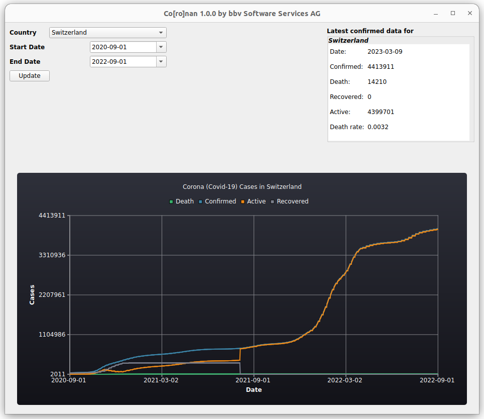

[](https://opensource.org/licenses/MIT)


[](https://svgshare.com/i/Zhy.svg)
[](https://svgshare.com/i/ZjP.svg)
[](https://svgshare.com/i/ZhY.svg)

[](https://github.com/bbvch/Coronan/actions/workflows/ci.yml)
[](https://bbvch.github.io/Coronan)
[](https://ci.appveyor.com/project/meshell/coronan/branch/master)

[](https://github.com/bbvch/Coronan/actions/workflows/codacy-analysis.yml)
[](https://github.com/bbvch/Coronan/actions/workflows/codeql-analysis.yml)
[](https://codecov.io/gh/bbvch/Coronan)
[](https://www.codacy.com/gh/bbvch/Coronan/dashboard?utm_source=github.com&utm_medium=referral&utm_content=bbvch/Coronan&utm_campaign=Badge_Grade)
[](https://www.codacy.com/gh/bbvch/Coronan/dashboard?utm_source=github.com&utm_medium=referral&utm_content=bbvch/Coronan&utm_campaign=Badge_Coverage)
[](https://scan.coverity.com/projects/bbvch-coronan)

[](https://gitpod.io/#https://github.com/bbvch/Coronan)

# Documentation for Co\[ro\]nan

Co\[ro\]nan is an example C++17 Qt project using [conan](https://conan.io/) and [CMake](https://cmake.org/).
It reads the current data of Corona (Covid-19) cases for a country from the [The About Corona Covid-19 API](https://about-corona.net/documentation).

_The About Corona Covid-19_ provides statistics via REST API from The [World Health Organization Situation Reports](https://www.who.int/emergencies/diseases/novel-coronavirus-2019/situation-reports), [Johns Hopkins CSSE](https://coronavirus.jhu.edu/map.html), [The U.S. Department of Health & Human Services](https://www.hhs.gov/), [The National Health Commission of the People’s Republic of China](http://en.nhc.gov.cn/), [The European Centre for Disease Prevention and Control](https://www.ecdc.europa.eu/en), and [China CDC Weekly](http://weekly.chinacdc.cn/news/TrackingtheEpidemic.htm).



## Features

This projects is a C++ project template. It includes everything a "Modern" C++ project possibly needs:
* C++ 17 Standard
  * [GCC](https://gcc.gnu.org/)
  * [Clang](https://clang.llvm.org/)
  * Visual Studio 2019

* [conan](https://conan.io/) package Manager

* Libraries used:
  * [Qt](https://www.qt.io/)
  * [Poco](https://pocoproject.org/) Networking library
  * [RapidJSON](https://rapidjson.org/)
  * [Lyra](https://github.com/bfgroup/Lyra) command line arguments parser
  * [{fmt}](https://github.com/fmtlib/fmt) formatting library

* Unittests with Coverage using [Catch2](https://github.com/catchorg/Catch2)

* CMake with [CMakePresets](https://cmake.org/cmake/help/latest/manual/cmake-presets.7.html) _(CMake >= 3.20)_

* CPack packaging:
  * Debian package
  * [Qt Installer Framework](https://doc.qt.io/qtinstallerframework/)
  * [WIX](https://wixtoolset.org/)

* Build Caching support:
  * [ccache](https://ccache.dev/)
  * [sccache](https://github.com/mozilla/sccache)

* Static Analyzer support:
  * [clang-tidy](https://clang.llvm.org/extra/clang-tidy/)
  * [cppcheck](http://cppcheck.sourceforge.net/)
  * [include-what-you-use](https://include-what-you-use.org/)

* Sanitizers support:
  * [Address Sanitizer](https://clang.llvm.org/docs/AddressSanitizer.html)
  * [Leak Sanitizer](https://clang.llvm.org/docs/LeakSanitizer.html)
  * [Undefined Behavior Sanitizer](https://clang.llvm.org/docs/UndefinedBehaviorSanitizer.html)
  * [Thread Sanitizer](https://clang.llvm.org/docs/ThreadSanitizer.html)
  * [Memory Sanitizer](https://clang.llvm.org/docs/MemorySanitizer.html)

* Documentation Generation using
  * [Sphinx](https://www.sphinx-doc.org/)
  * [Breath](https://breathe.readthedocs.io/)
  * [Doxygen](https://www.doxygen.nl/index.html)

* Code formatting:
  * [clang-format](https://clang.llvm.org/docs/ClangFormat.html) for C++ files
  * [cmake-format](https://pypi.org/project/cmake-format/) for CMake files

* [Pre-commit-hooks](https://github.com/pre-commit/pre-commit-hooks) support

* [Nix](https://nixos.org) environment support

* [gitpod](https://www.gitpod.io/) support

* Continuous integration (CI):
  * GitHub Action
    * linux gcc & clang build

    * Mac OS X
      * 10.15 _(AppleClang 12)_
      * 11 _(AppleClang 13)_

    * Ubuntu 18.04
      * GCC 7 & 9
      * Clang 9

    * Ubuntu 20.04
      * GCC 9 & 10
      * Clang 10, 11 & 12

    * Nix
      * GCC 10
      * Clang 11

    * [Codacy Security Scan](https://github.com/marketplace/actions/codacy-analysis-cli)

    * [Codacy](https://www.codacy.com) Coverage Reporter

    * [CodeQL Static Analysis](https://github.com/github/codeql-action)

    * [Coverity Scan Static Analysis](https://scan.coverity.com/)

    * [Codecov](https://codecov.io) Coverage Reporter


  * [AppVeyor](https://www.appveyor.com/)
    * Windows Visual Studio 2019

## Development

To build the project you need python and a recent [conan version](https://conan.io/):

```bash
#> pip install conan
```

Further a recent version of [CMake](https://cmake.org/) (> 3.15), a modern C++ compiler (C++17) and [Qt](https://www.qt.io/) with [QtCharts](https://doc.qt.io/qt-5/qtcharts-index.html) must be installed.

### How to build

You have the following options to build the project

__Use build script__:

In a linux shell you can build the project with the provided `build.sh` script. E.g. to build in folder `build` execute:

```bash
#> ./build.sh build
```

See `./build.sh -h` for more options

__CMake__:

You can also build it yourself using CMake:

* cmake < 3.20

  ```bash
  #> mkdir build
  #> (cd build && cmake ..)
  #> cmake --build build
  ```

* cmake >= 3.20

  ```bash
  #> cmake -S . --preset=linux-ninja
  #> cmake --build -S . --preset=ninja-debug
  ```

  or any other [CMakePresets](CMakePresets.json).

### Source Code formatting

For source code formatting [clang-format](https://clang.llvm.org/docs/ClangFormat.html) for C++ files and [cmake-format](https://pypi.org/project/cmake-format/) for the CMake files are used. Run `format_source_files.sh` to format all C++ and CMake files.

_Note: Delete the build directory before formatting, otherwise all CMake files in the build folder will be formatted as well, what may take a while._

### CMake options

* `ENABLE_TESTING`: Build (and run) unittests. _Default_: `ON`
* `ENABLE_BUILD_WITH_TIME_TRACE`: Enable [Clang Time Trace Feature](https://www.snsystems.com/technology/tech-blog/clang-time-trace-feature). _Default: `OFF`_
* `ENABLE_PCH`: Enable [Precompiled Headers](https://en.wikipedia.org/wiki/Precompiled_header). _Default: `OFF`_
* `ENABLE_CACHE`: Enable caching if available, e.g. [ccache](https://ccache.dev/) or [sccache](https://github.com/mozilla/sccache). _Default: `ON`_
* `ENABLE_COVERAGE`: Enable coverage reporting for gcc/clang. _Default: `OFF`_
* `ENABLE_DOXYGEN`: Enable doxygen documentation build ([Doxygen](https://www.doxygen.nl/index.html) must be installed). _Default: `ON`_ if Doxygen is installed `OFF` otherwise._
* `ENABLE_SPHINX`: Enable sphinx documentation build ([Sphinx](https://www.sphinx-doc.org/) with [Breath](https://breathe.readthedocs.io/) must be installed). _Default: `ON`_ if Sphinx is installed `OFF` otherwise._
* `ENABLE_SANITIZER_ADDRESS`: Enable [address sanitizer](https://clang.llvm.org/docs/AddressSanitizer.html). _Default: `OFF`_
* `ENABLE_SANITIZER_LEAK`: Enable [leak sanitizer](https://clang.llvm.org/docs/LeakSanitizer.html). _Default: `OFF`_
* `ENABLE_SANITIZER_UNDEFINED_BEHAVIOR`: Enable [undefined behavior sanitizer](https://clang.llvm.org/docs/UndefinedBehaviorSanitizer.html). _Default: `OFF`_
* `ENABLE_SANITIZER_THREAD`: Enable [thread sanitizer](https://clang.llvm.org/docs/ThreadSanitizer.html). _Default: `OFF`_
* `ENABLE_SANITIZER_MEMORY`: Enable [memory sanitizer](https://clang.llvm.org/docs/MemorySanitizer.html). _Default: `OFF`_
* `ENABLE_IPO`: Enable Interprocedural Optimization, aka [Link Time Optimization (LTO)](https://llvm.org/docs/LinkTimeOptimization.html). _Default: `OFF`_
* `ENABLE_CPPCHECK`: Enable static analysis with [cppcheck](http://cppcheck.sourceforge.net/). _Default: `ON` if cppcheck is installed `OFF` otherwise._
* `ENABLE_CLANG_TIDY`: Enable static analysis with [clang-tidy](https://clang.llvm.org/extra/clang-tidy/). _Default: `ON` if clang-tidy is installed `OFF` otherwise._
* `ENABLE_INCLUDE_WHAT_YOU_USE`: Enable static analysis with [include-what-you-use](https://include-what-you-use.org/). _Default: `ON` if include-what-you-use is installed `OFF` otherwise_.
* `ENABLE_CONAN_BUILD_ALL`: Enable building all conan requires from source. May help if you get linking errors. _Default: `OFF`

## Pre-Commit Hooks

The following [Pre-commit-hooks](https://github.com/pre-commit/pre-commit-hooks) are used to check and format files before commiting:

* `check-added-large-files`: Prevent giant files (> 500kB) from being committed.
* `fix-byte-order-marker`: Forbid files which have a UTF-8 byte-order marker
* `check-case-conflict`: Check for files with names that would conflict on a case-insensitive filesystem like MacOS HFS+ or Windows FAT.
* `check-merge-conflict`: Check for files that contain merge conflict strings.
* `check-symlinks`: Checks for symlinks which do not point to anything.
* `check-yaml`: Attempts to load all yaml files to verify syntax.
* `check-json`: Attempts to load all json files to verify syntax.
* `check-toml`: Attempts to load all TOML files to verify syntax.
* `check-executables-have-shebangs`: Checks that non-binary executables have a proper shebang.
* `end-of-file-fixer`: Makes sure files end in a newline and only a newline.
* `mixed-line-ending`: Replaces or checks mixed line ending.
* `trailing-whitespace`: Trims trailing whitespace in markdown
* `clang-format`: Format C++ files using clang-format
* `cmake-format`: Format CMake files using cmake-format
* `yamllint`: Linter for yaml files
* `yamlfmt`: Format yaml files

Please install pre-commit hooks before commiting any code.

## Gitpod

To start right away without installing anything on you local machine, you can simply use the  Button at the top of this README.

## direnv & Nix

If you have [direnv](https://direnv.net/) and [nix](https://nixos.org/) installed everything should be setup to start upon entering the project folder. gcc (gcc10) is set as default C and C++ compiler. If you prefare clang (clang_11) change it in [.envrc](.envrc)

When using nix. The most resent cmake is available and therefore configure and build [CMakePresets](https://cmake.org/cmake/help/latest/manual/cmake-presets.7.html) can be used.
