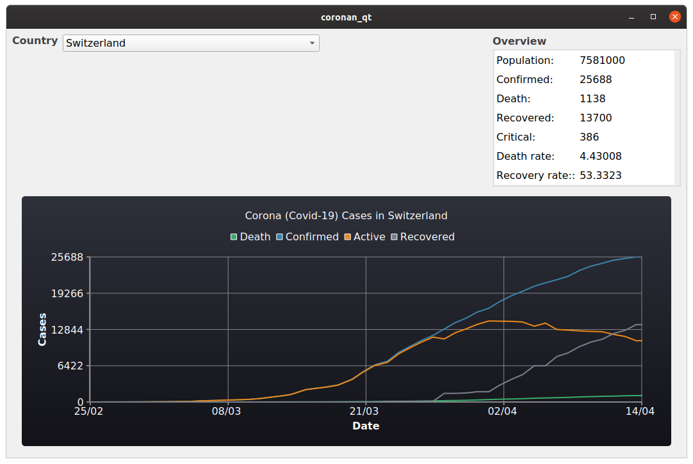

Documentation for Co\[ro\]nan
=====================================

Co\[ro\]nan is an example C++17 Qt project using `conan <https://conan.io/>`_ and `CMake <https://cmake.org/>`_.
It reads the current data of Corona (Covid-19) cases for a country from the `The About Corona Covid-19 API <https://about-corona.net/documentation>`_.

*The About Corona Covid-19* provides statistics via REST API from The `World Health Organization Situation Reports <https://www.who.int/emergencies/diseases/novel-coronavirus-2019/situation-reports>`_,  `Johns Hopkins CSSE <https://coronavirus.jhu.edu/map.html>`_, `The U.S. Department of Health & Human Services <https://www.hhs.gov/>`_, `The National Health Commission of the People’s Republic of China <http://en.nhc.gov.cn/>`_, `The European Centre for Disease Prevention and Control <https://www.ecdc.europa.eu/en>`_, and `China CDC Weekly <http://weekly.chinacdc.cn/news/TrackingtheEpidemic.htm>`_.



Development
-----------

To build the project you need python and a recent `conan version <https://conan.io/>`_:

.. code-block:: bash

  #> pip install conan


Further a recent version of `CMake <https://cmake.org/>`_ (> 3.15), a modern C++ compiler (C++17) and `Qt <https://www.qt.io/>`_ with `QtCharts <https://doc.qt.io/qt-5/qtcharts-index.html>`_ must be installed.

How to build
^^^^^^^^^^^^

You have the following options to build the project

**Use build script**:

In a linux shell you can build the project with the provided ``build.sh`` script. E.g. to build in folder ``build`` execute:

.. code-block:: bash

  #> ./build.sh build


See ``./build.sh -h`` for more options

**CMake**:

You can also build it yourself using CMake:

* cmake < 3.20

.. code-block:: bash

  #> mkdir build
  #> (cd build && cmake ..)
  #> cmake --build build


* cmake >= 3.20

.. code-block:: bash

  #> cmake -S . --preset=linux-ninja
  #> cmake --build -S . --preset=ninja-debug


or any other ``CMakePresets``.

Source Code formatting
^^^^^^^^^^^^^^^^^^^^^^

For source code formatting `clang-format <https://clang.llvm.org/docs/ClangFormat.html>`_ for C++ files and `cmake-format <https://pypi.org/project/cmake-format/>`_ for the CMake files are used. Run ``format_source_files.sh`` to format all C++ and CMake files.

*Note: Delete the build directory before formatting, otherwise all CMake files in the build folder will be formatted as well, what may take a while.*

CMake options
^^^^^^^^^^^^^

* ``ENABLE_TESTING``: Build (and run) unittests. _Default_: ```ON```
* ``ENABLE_BUILD_WITH_TIME_TRACE``: Enable `Clang Time Trace Feature <https://www.snsystems.com/technology/tech-blog/clang-time-trace-feature>`_. *Default: ```OFF```*
* ``ENABLE_PCH``: Enable `Precompiled Headers <https://en.wikipedia.org/wiki/Precompiled_header>`_. *Default: ``OFF``*
* ``ENABLE_CACHE``: Enable caching if available, e.g. `ccache> https://ccache.dev/>`_ or `sccache <https://github.com/mozilla/sccache>`_. *Default: ``ON``*
* ``ENABLE_COVERAGE``: Enable coverage reporting for gcc/clang. *Default: ```OFF```*
* ``ENABLE_DOXYGEN``: Enable doxygen documentation build (`doxygen <https://www.doxygen.nl/index.html>`_ with `graphviz dot <https://graphviz.org/>`_ must be installed). *Default: ```ON```*
* ``ENABLE_SANITIZER_ADDRESS``: Enable `address sanitizer <https://clang.llvm.org/docs/AddressSanitizer.html>`_. *Default: ```OFF```*
* ``ENABLE_SANITIZER_LEAK``: Enable `leak sanitizer <https://clang.llvm.org/docs/LeakSanitizer.html>`_. *Default: ```OFF```*
* ``ENABLE_SANITIZER_UNDEFINED_BEHAVIOR``: Enable `undefined behavior sanitizer <https://clang.llvm.org/docs/UndefinedBehaviorSanitizer.html>`_. *Default: ```OFF```*
* ``ENABLE_SANITIZER_THREAD``: Enable `thread sanitizer <https://clang.llvm.org/docs/ThreadSanitizer.html>`_. *Default: ```OFF```*
* ``ENABLE_SANITIZER_MEMORY``: Enable `memory sanitizer <https://clang.llvm.org/docs/MemorySanitizer.html>`_. *Default: ```OFF```*
* ``ENABLE_IPO``: Enable Interprocedural Optimization, aka `Link Time Optimization (LTO) <https://llvm.org/docs/LinkTimeOptimization.html>`_. *Default: ```OFF```*
* ``ENABLE_CPPCHECK``: Enable static analysis with `cppcheck <http://cppcheck.sourceforge.net/>`_. *Default: ``ON`` if cppcheck is installed ``OFF`` otherwise.*
* ``ENABLE_CLANG_TIDY``: Enable static analysis with `clang-tidy <https://clang.llvm.org/extra/clang-tidy/>`_. *Default: ``ON`` if clang-tidy is installed ``OFF`` otherwise.*
* ``ENABLE_INCLUDE_WHAT_YOU_USE``: Enable static analysis with `include-what-you-use <https://include-what-you-use.org/>`_. *Default: ``ON`` if include-what-you-use is installed ``OFF`` otherwise.*
* ``ENABLE_CONAN_BUILD_ALL``: Enable building all conan requires from source. May help if you get linking errors. *Default: ``OFF``

Pre-Commit Hooks
----------------

The following `Pre-commit-hooks <https://github.com/pre-commit/pre-commit-hooks>`_ are used to check and format files before commiting:

* ``check-added-large-files``: Prevent giant files (> 500kB) from being committed.
* ``fix-byte-order-marker``: Forbid files which have a UTF-8 byte-order marker
* ``check-case-conflict``: Check for files with names that would conflict on a case-insensitive filesystem like MacOS HFS+ or Windows FAT.
* ``check-merge-conflict``: Check for files that contain merge conflict strings.
* ``check-symlinks``: Checks for symlinks which do not point to anything.
* ``check-yaml``: Attempts to load all yaml files to verify syntax.
* ``check-json``: Attempts to load all json files to verify syntax.
* ``check-toml``: Attempts to load all TOML files to verify syntax.
* ``check-executables-have-shebangs``: Checks that non-binary executables have a proper shebang.
* ``end-of-file-fixer``: Makes sure files end in a newline and only a newline.
* ``mixed-line-ending``: Replaces or checks mixed line ending.
* ``trailing-whitespace``: Trims trailing whitespace in markdown
* ``clang-format``: Format C++ files using clang-format
* ``cmake-format``: Format CMake files using cmake-format
* ``yamllint``: Linter for yaml files
* ``yamlfmt``: Format yaml files

Please install pre-commit hooks before commiting any code.

direnv & Nix
------------

If you have `direnv <https://direnv.net/>`_ and `nix <https://nixos.org/>`_ installed everything should be setup to start upon entering the project folder. gcc (gcc10) is set as default C and C++ compiler. If you prefare clang (clang_11) change it in ``.envrc``

When using nix. The most resent cmake is available and therefore configure and build `CMakePresets <https://cmake.org/cmake/help/latest/manual/cmake-presets.7.html>`_ can be used.
